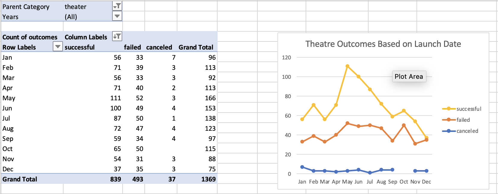
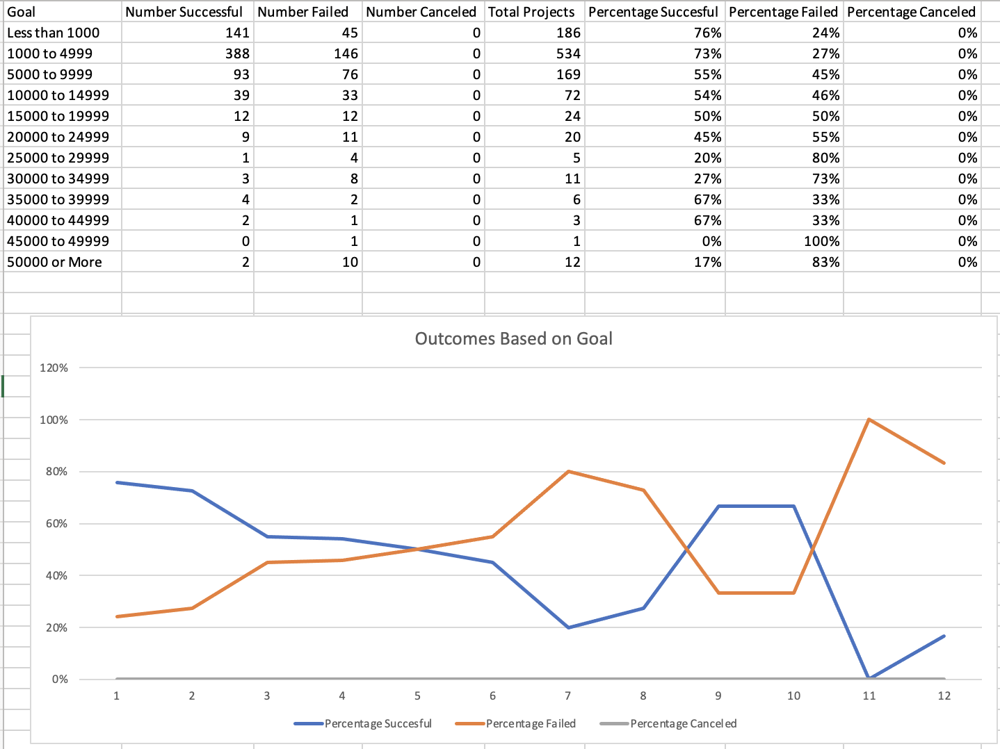

# Analysis of Kickstarter Campaigns

Repositry Link: https://github.com/luis-zavalaa/kicksarter-analysis

* Providing a complete analysis on various different kickstarter campaigns relative to to date they were launched as well as monetary goals. Allowing us to provide a statistical and concrete analysis to Louise on her own kickstarter campaign.

## Analysis and Challenges

### Outcomes Based on Launch Date

* Based on my analysis of Kickstarter Campaigns in the Theater industry the best possible time to start a campaign would be in the months of May / June. 

### Analysis of Outcomes Based on Goals

* In the Analysis of the Outcomes based on Goals we found that plays under a total value of $5,000 have the best chance of being successful. 

### Challenges and Difficulties Encountered

## Results

- What are two conclusions you can draw about the Outcomes based on Launch Date?

- What can you conclude about the Outcomes based on Goals?

- What are some limitations of this dataset?

- What are some other possible tables and/or graphs that we could create?
