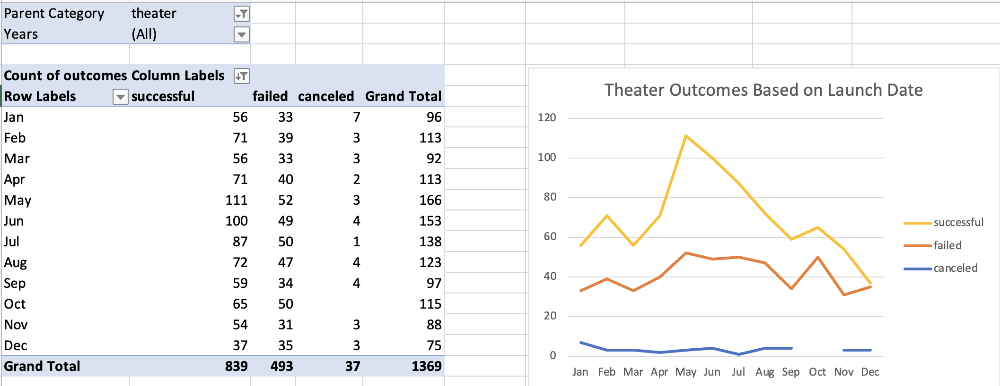

# Analysis of Kickstarter Campaigns

Repositry Link: https://github.com/luis-zavalaa/kicksarter-analysis

* Providing a complete analysis on various different kickstarter campaigns relative to to date they were launched as well as monetary goals. Allowing us to provide a statistical and concrete analysis to Louise on her own kickstarter campaign.

## Analysis and Challenges

### Outcomes Based on Launch Date

* Based on my analysis of Kickstarter Campaigns in the Theater industry the best possible time to start a campaign would be in the months of May / June. 
* Looking more broadly, the beggining of the summer months (May, June, & July) have been the most promising in order to attain a successful campaign.

### Analysis of Outcomes Based on Goals

* In the Analysis of the Outcomes Based on Goals we found that plays under a total value of $5,000 have the best chance of being successfully funded. 

### Challenges and Difficulties Encountered

* Some of the challenges faced with this project was keeping the data correctly. At one point in the process the ‘pledged’ column became mixed up which caused time being spent going back to fix it.

## Results

#### What are two conclusions you can draw about the Outcomes based on Launch Date?

* In conclusion, the data suggests the best time to start a kickstarter campaign is in the months of May and June

* The analysis shows the most successful campaigns relative to launch date with a 67% and 65% success rate respectively 
  

#### What can you conclude about the Outcomes based on Goals?

* Looking at our graphic after the $5,000 mark there becomes a 18% downward shift in success rate. Providng us with evidence that keeping our play under $5,000 would be beneficial. 

#### What are some limitations of this dataset?

* Looking at our data, some limitations seen are when considering out Outcomes based on Goals we see a shortage of data in the higher end of the spectrum. We really cannot make a statistical analysis on plays with a goal of $35,000 or more. 

#### What are some other possible tables and/or graphs that we could create?

* Another graph that would display our analysis in an efficient manner would be a bar graph. A bar graph could display the goal to attain data. As well as another way to portray the outcomes based on launch date in a different manner. 
 
